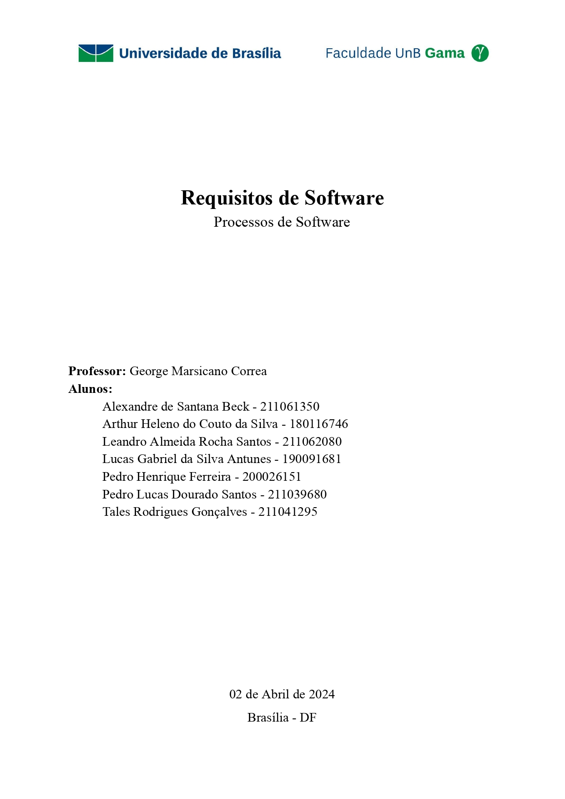
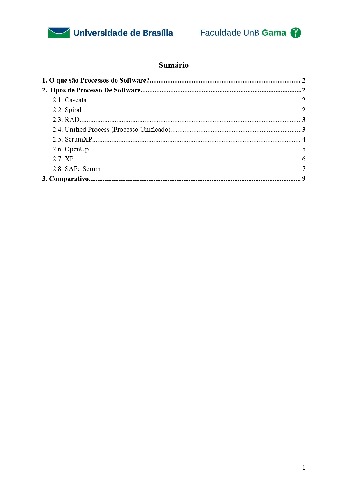
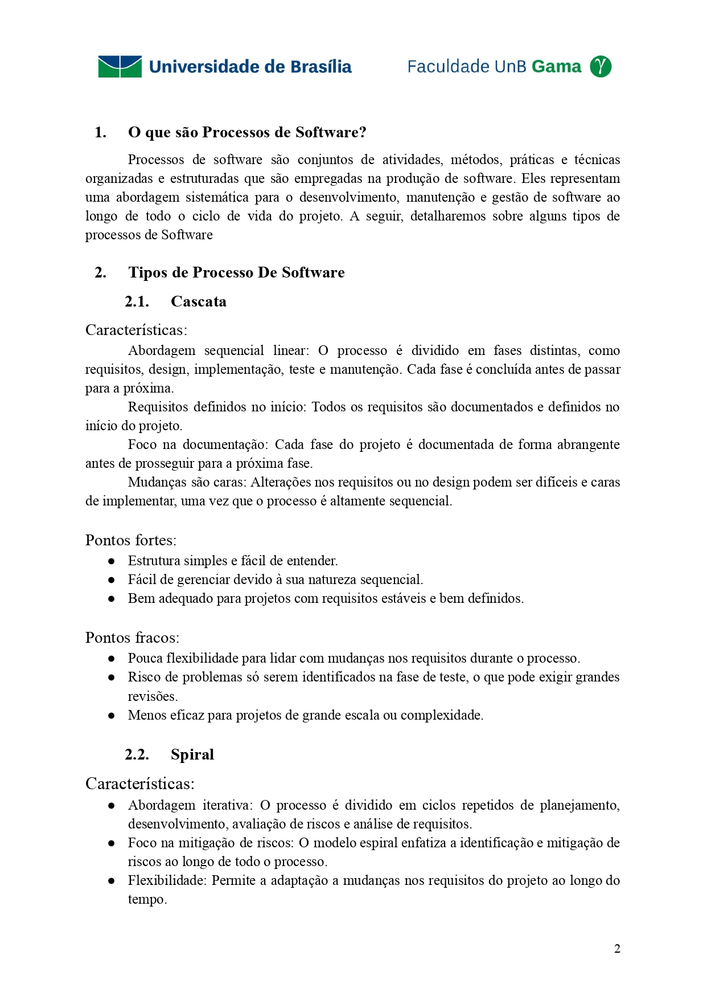
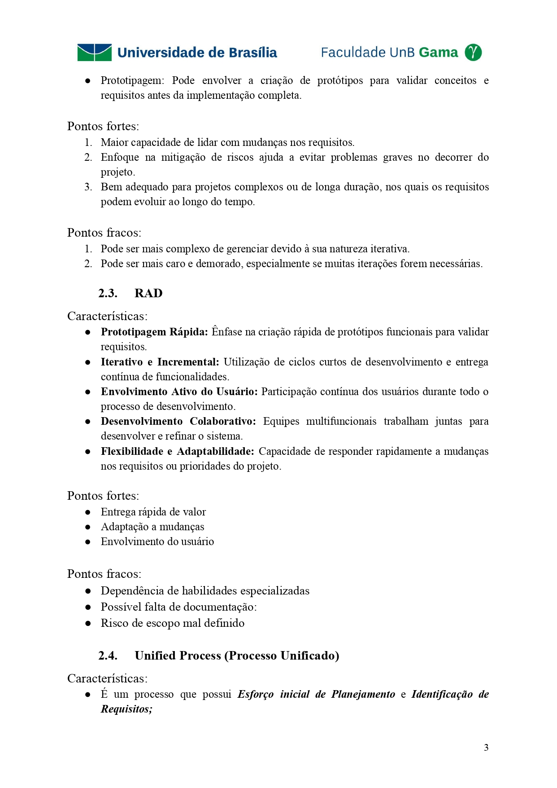
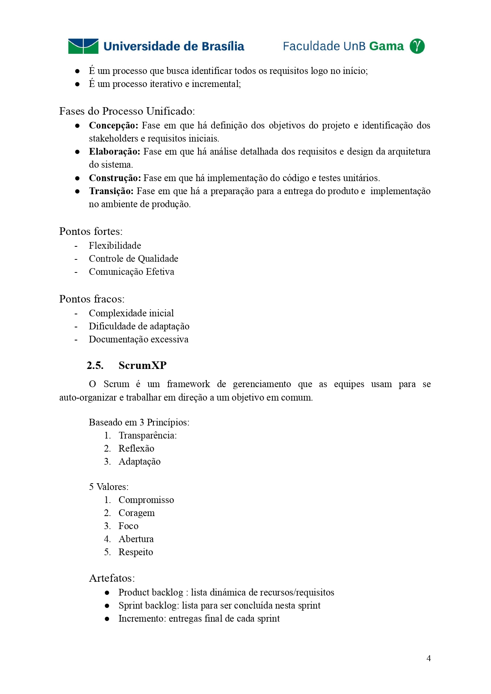
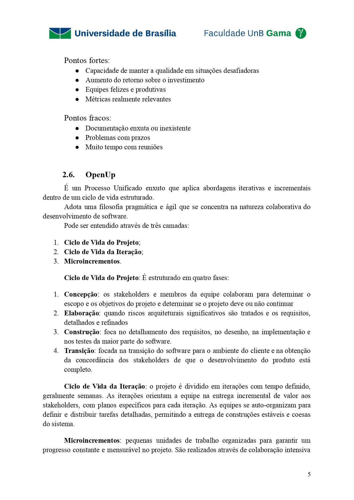
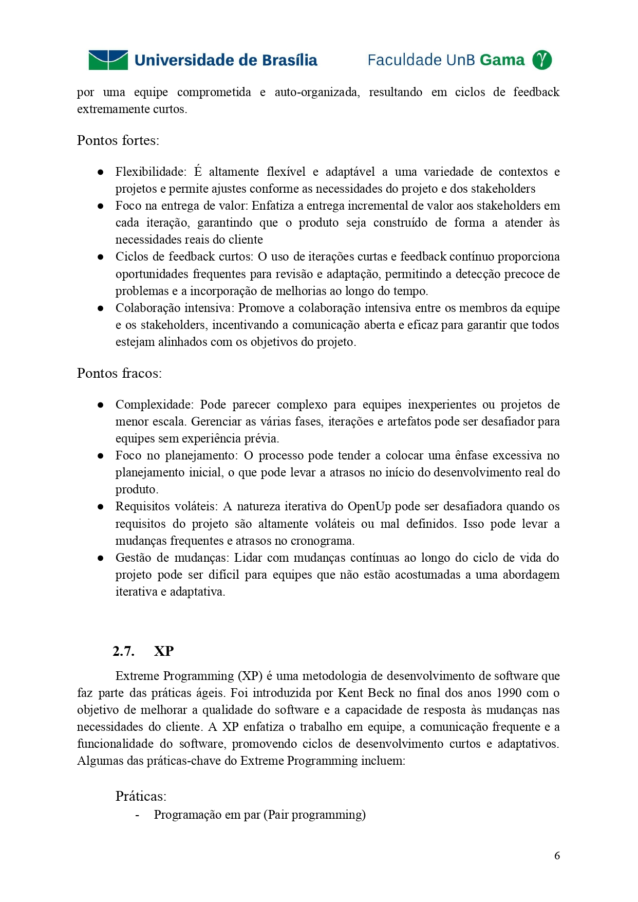
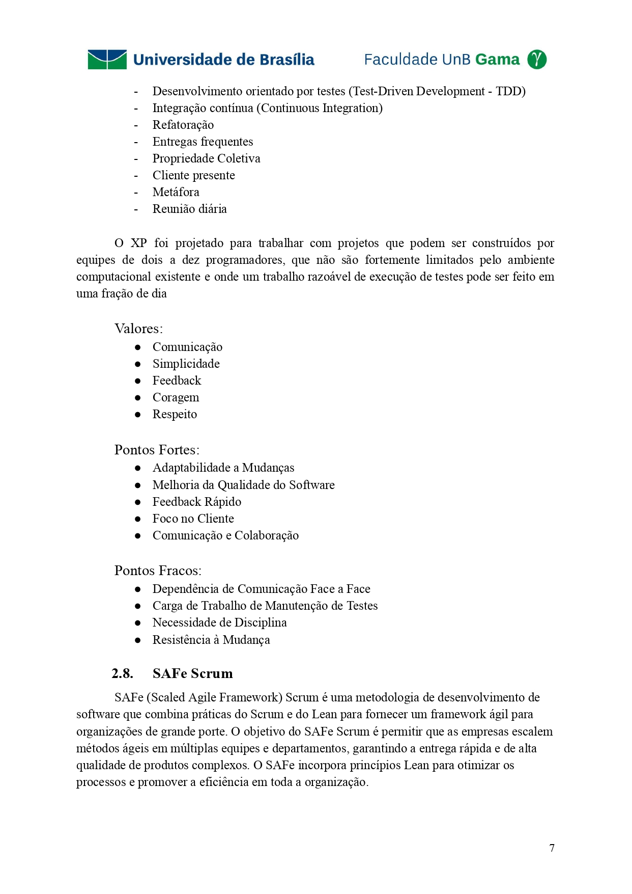
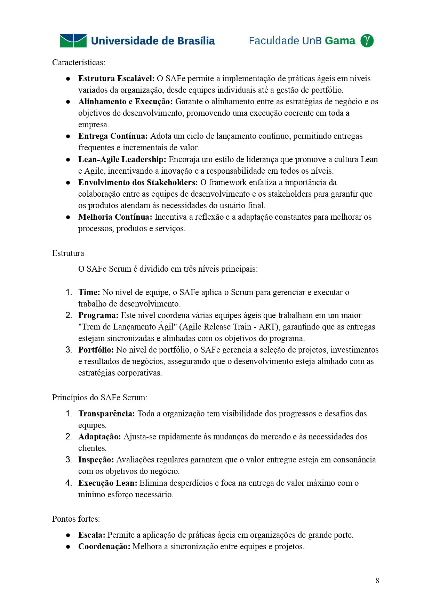
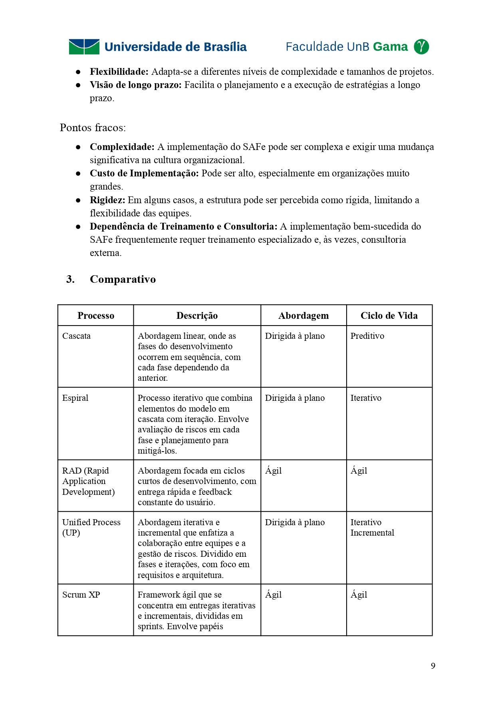

## 1. Processos de Engenharia de Software

### Material que consta características de todos os processos, mostrando pontos fortes e fracos de cada um e fazendo uma comparação

### Data de entrega: 02/04/2024

## 2. Historico de revisão

|    Data    | Versão |              Descrição              |                      Autor(es)                      |
| :--------: | :----: | :---------------------------------: | :-------------------------------------------------: |
| 17/04/2024 | `0.1`  | Criação e Estruturação do documento | [Pedro Lucas Dourado](https://github.com/lucasdray) |
