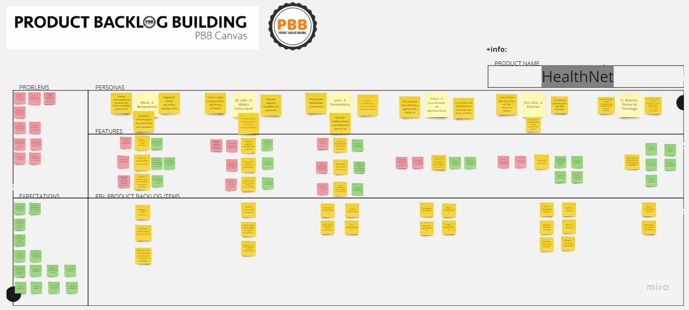
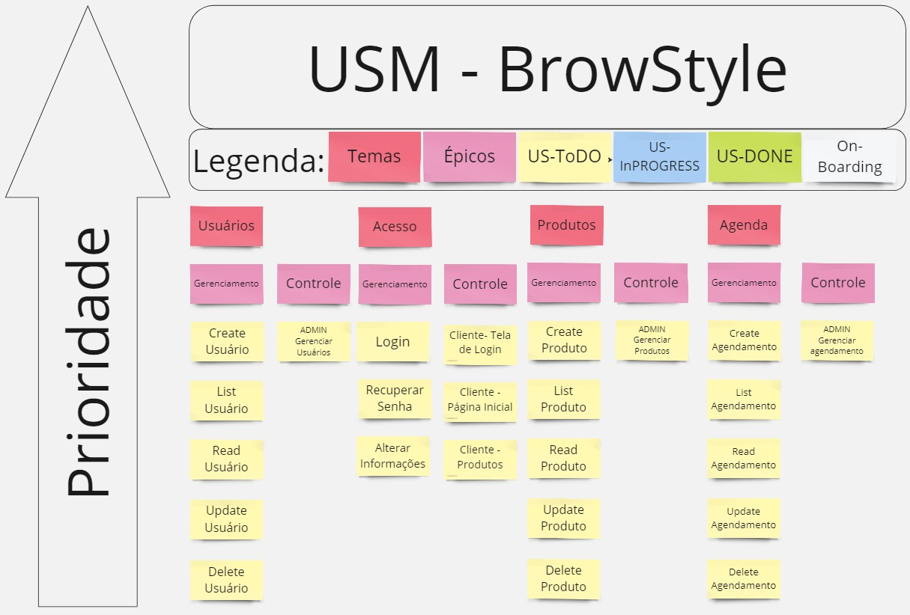

# Unidade 3

## 1. Introdução
Este documento tem como objetivo apresentar as atividades realizadas durante a Missão 3, que envolvem os exercicios da práticas de PBB (Product Backlog Building) e USM (User Story Mapping). A missão foi concebida para aprimorar as habilidades na construção e priorização de backlog de produto, além de mapear e organizar as histórias de usuários de forma eficaz. O PBB e o USM são ferramentas essenciais para a definição clara dos requisitos e para a entrega incremental de valor ao cliente, garantindo um desenvolvimento ágil e focado nas reais necessidades dos usuários. A seguir, serão descritas as atividades desempenhadas, bem como os principais aprendizados e desafios enfrentados ao longo desta missão.

## 2. PBB (Product Backlog Building)
Abaixo se encontra o PBB construido pelo grupo para o cénario da "HealthNet":

<iframe width="768" height="432" src="https://miro.com/app/live-embed/uXjVKtv6zR0=/?moveToViewport=-4227,945,9511,4346&embedId=176194666931" frameborder="0" scrolling="no" allow="fullscreen; clipboard-read; clipboard-write" allowfullscreen></iframe>

## 3. USM (User Story Maping)
Abaixo se encontra o PBB construido pelo grupo em relação ao projeto "BrowStyle" idealizado pelos integrantes do grupo "Ordem dos Caçadores Cósmicos":

<iframe width="768" height="432" src="https://miro.com/app/live-embed/uXjVKtv6zR0=/?moveToViewport=6564,1695,3365,2153&embedId=175104139077" frameborder="0" scrolling="no" allow="fullscreen; clipboard-read; clipboard-write" allowfullscreen></iframe>

## 4. Histórico de revisão

| Data       | Versão | Alteração            | Autor                                      |
| ---------- | ------ | -------------------- | ------------------------------------------ |
| 23/08/2024 | `1.0`  | Criação do documento | [Pedro Luca](https://github.com/lucasdray) |
