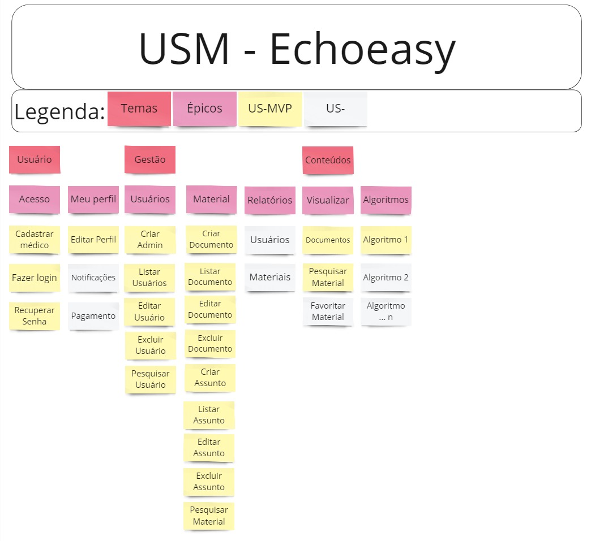

# MVP
## 1. Introdução
Este documento descreve o processo de priorização e definição do MVP, mostrando a metodologia utilizada e mostrando a lista de funcionalidades escolhidas para compor o MVP

## 2. USM
Para garantir uma entrega de valor e uma priorização adequada das funcionalidades do projeto, utilizamos a metodologia USM (User Story Mapping). Através dessa abordagem, foi possível identificar e organizar as funcionalidades mais críticas e valiosas para o Product Owner, alinhando as prioridades do backlog com os objetivos do produto. Abaixo, na imagem 01, mostramos como o USM foi aplicado para priorizar as funcionalidades encontradas no backlog e como essas funcionalidades foram selecionadas para compor o MVP. As funcionalidades com maior priorização se encontram mais a cima e a esquerda, enquanto as de menor priorização se encontram mais abaixo e para direita.

## 3. MVP

O MVP foi cuidadosamente planejado para incluir as funcionalidades essenciais que proporcionam valor imediato aos usuários. As funcionalidades selecionadas para o MVP foram priorizadas com base na metodologia USM, focando naquelas que oferecem o maior impacto e utilidade para médicos e administradores. O objetivo do MVP é validar a viabilidade do produto, coletar feedback dos usuários e orientar o desenvolvimento contínuo com base nas necessidades reais e experiências práticas. Abaixo, na tabela 01, estão listadas as funcionalidades incluídas no MVP, juntamente com seus respectivos critérios de aceitação.

**Tabela 01** - Listagem do MVP

| Épico              | Capacidade                  | Feature                                  | User Story | Critérios de Aceitação                                                                                                                                                                                                                                                                                                                                                       |
| ------------------ | :-------------------------- | :--------------------------------------- | ---------- | ---------------------------------------------------------------------------------------------------------------------------------------------------------------------------------------------------------------------------------------------------------------------------------------------------------------------------------------------------------------------------- |
| EP-01 - Acesso     | CA01 - Acesso               | FE01 - Cadastrar médico                  | US01       | 1. O sistema deve permitir o registro com nome, email, CPF, senha e confirmação de senha.   2. O sistema deve verificar se o email já está registrado e exibir uma mensagem de erro apropriada.   3. O sistema deve exigir que a senha tenha pelo menos 8 caracteres, incluindo uma letra maiúscula, uma minúscula, um número e um caractere especial.                 |
| EP-01 - Acesso     | CA01 - Acesso               | FE02 - Fazer login                       | US02, US03 | 1. O sistema deve permitir login com email e senha.   2. O sistema deve redirecionar o usuário para a página inicial adequada de acordo com a role após login bem-sucedido.   3. O sistema deve exibir uma mensagem de erro caso as credenciais estejam incorretas.   4. O sistema deve permitir ao usuário lembrar da sua sessão por 30 minutos.                   |
| EP-01 - Acesso     | CA01 - Acesso               | FE03 - Recuperar Senha                   | US04       | 1. O sistema deve permitir o envio de um token de redefinição de senha por email.   2. O sistema deve permitir a criação de uma nova senha a partir do link.   3. O sistema deve validar se a nova senha atende aos requisitos de segurança.   4. O sistema deve exibir uma mensagem de confirmação após a redefinição de senha bem-sucedida.                       |
| EP-02 - Meu perfil | CA02 - Dados do usuário     | FE04 - Editar Perfil                     | US05       | 1. O sistema deve permitir a edição de informações como nome, email, senha e outras informações pessoais.   2. O sistema deve salvar as alterações e confirmar a atualização.   3. O sistema deve verificar se o novo email (se alterado) já está registrado e exibir uma mensagem de erro apropriada.                                                                 |
| EP-02 - Meu perfil | CA02 - Dados do usuário     | FE05 - Pagamento                         | US06       | 1. O sistema deve permitir acesso à área de finanças com opções de visualizar, atualizar ou cancelar assinatura.   2. O sistema deve exibir o histórico de pagamentos e faturas.   3. O sistema deve permitir a atualização das informações de pagamento.                                                                                                              |
| EP-02 - Meu perfil | CA03 - Atualizações         | FE05 - Notificações                      | US27       | 1. O sistema deve exibir notificações sobre novos documentos, atualizações e outras informações relevantes.   2. O sistema deve permitir a visualização detalhada das notificações.   3. O sistema deve permitir ao usuário marcar notificações como lidas ou não lidas.                                                                                               |
| EP-03 - Usuários   | CA04 - Administração        | FE06 - Criar Admin                       | US07       | 1. O sistema deve permitir administradores criarem novos administradores   2. O sistema deve verificar se o email já está registrado e exibir uma mensagem de erro apropriada.                                                                                                                                                                                            |
| EP-03 - Usuários   | CA04 - Administração        | FE07 - Listar Usuários                   | US08       | 1. O sistema deve exibir uma lista paginada de usuários com nome, email e status da conta.   2. O sistema deve permitir filtrar a lista por status (ativo, inativo, pendente).   3. O sistema deve permitir ordenar a lista por nome, email ou data de cadastro.                                                                                                       |
| EP-03 - Usuários   | CA04 - Administração        | FE08 - Editar Usuário                    | US09       | 1. O sistema deve permitir editar informações do usuário como nome, email, senha e status.   2. O sistema deve salvar as alterações e confirmar a atualização.   3. O sistema deve verificar se o novo email (se alterado) já está registrado e exibir uma mensagem de erro apropriada.   4. O sistema deve permitir ao administrador redefinir a senha do usuário. |
| EP-03 - Usuários   | CA04 - Administração        | FE09 - Excluir Usuário                   | US10       | 1. O sistema deve permitir excluir um usuário e confirmar a exclusão com uma mensagem de sucesso.   2. O sistema deve solicitar uma confirmação antes da exclusão definitiva.   3. O sistema deve remover todos os dados associados ao usuário excluído.                                                                                                               |
| EP-03 - Usuários   | CA04 - Administração        | FE10 - Pesquisar Usuário                 | US11       | 1. O sistema deve permitir a pesquisa de usuários por nome ou email.   2. O sistema deve permitir filtrar os resultados por status da conta.   3. O sistema deve permitir a pesquisa avançada por outros critérios, como data de cadastro ou último login.                                                                                                             |
| EP-04 - Material   | CA04 - Administração        | FE11 - Criar Documento                   | US12       | 1. O sistema deve permitir a criação de documentos com título, conteúdo e categoria.   2. O sistema deve confirmar a criação com uma mensagem de sucesso.   3. O sistema deve permitir o upload de arquivos anexos ao documento.                                                                                                                                       |
| EP-04 - Material   | CA04 - Administração        | FE12 - Listar Documentos                 | US13       | 1. O sistema deve exibir uma lista paginada de documentos com título, data de criação e categoria.   2. O sistema deve permitir filtrar a lista por categoria.   3. O sistema deve permitir ordenar a lista por título, data de criação ou popularidade.                                                                                                               |
| EP-04 - Material   | CA04 - Administração        | FE13 - Editar Documento                  | US14       | 1. O sistema deve permitir a edição de título, conteúdo e categoria de um documento.   2. O sistema deve confirmar a atualização com uma mensagem de sucesso.   3. O sistema deve permitir o upload de novos arquivos anexos ao documento.   4. O sistema deve manter um histórico de edição do documento.                                                          |
| EP-04 - Material   | CA04 - Administração        | FE14 - Excluir Documento                 | US15       | 1. O sistema deve permitir excluir um documento e confirmar a exclusão com uma mensagem de sucesso.   2. O sistema deve solicitar uma confirmação antes da exclusão definitiva.   3. O sistema deve remover todos os dados associados ao documento excluído.                                                                                                           |
| EP-04 - Material   | CA04 - Administração        | FE15 - Criar Assunto                     | US16       | 1. O sistema deve permitir a criação de assuntos relacionados a documentos com título e conteúdo.   2. O sistema deve confirmar a criação com uma mensagem de sucesso.   3. O sistema deve permitir o upload de arquivos anexos ao assunto.                                                                                                                            |
| EP-04 - Material   | CA04 - Administração        | FE16 - Listar Assuntos                   | US17       | 1. O sistema deve exibir uma lista de assuntos relacionados a cada documento.   2. O sistema deve permitir filtrar a lista por documento.   3. O sistema deve permitir ordenar a lista por título, data de criação ou popularidade.                                                                                                                                    |
| EP-04 - Material   | CA04 - Administração        | FE17 - Editar Assunto                    | US18       | 1. O sistema deve permitir a edição de título e conteúdo de um assunto.   2. O sistema deve confirmar a atualização com uma mensagem de sucesso.   3. O sistema deve permitir o upload de novos arquivos anexos ao assunto.   4. O sistema deve manter um histórico de edição do assunto.                                                                           |
| EP-04 - Material   | CA04 - Administração        | FE18 - Excluir Assunto                   | US19       | 1. O sistema deve permitir excluir um assunto e confirmar a exclusão com uma mensagem de sucesso.   2. O sistema deve solicitar uma confirmação antes da exclusão definitiva.   3. O sistema deve remover todos os dados associados ao assunto excluído.                                                                                                               |
| EP-04 - Material   | CA04 - Administração        | FE19 - Pesquisar Material                | US20       | 1. O sistema deve permitir a pesquisa de documentos por título ou conteúdo.   2. O sistema deve exibir resultados relevantes da pesquisa.                                                                                                                                                                                                                                 |
| EP-05 - Relatórios | CA05 -  Análise de Dados    | FE20 - Visualizar relatórios de usuários | US21       | 1. O sistema deve gerar relatórios com dados estatísticos sobre documentos, como número total de documentos, documentos mais acessados e documentos por categoria.   2. O sistema deve permitir a visualização de gráficos e tabelas no relatório.                                                                                                                        |
| EP-05 - Relatórios | CA05 - Análise de Dados     | FE21 - Visualizar relatórios de usuários | US22       | 1. O sistema deve gerar relatórios com dados estatísticos sobre médicos cadastrados, como número total, novos cadastros por mês e relação de médicos cadastrados ativos e inativos.   2. O sistema deve permitir a visualização de gráficos e tabelas no relatório.                                                                                                       |
| EP-06 - Visualizar | CA06 - Acesso aos Materiais | FE22 - Visualizar Documentos             | US23       | 1. O sistema deve permitir o acesso a documentos com título, conteúdo e data de publicação.                                                                                                                                                                                                                                                                                  |
| EP-06 - Visualizar | CA06 - Acesso aos Materiais | FE23 - Pesquisar Material                | US24       | 1. O sistema deve permitir a pesquisa de documentos por título ou conteúdo.   2. O sistema deve exibir resultados relevantes da pesquisa.                                                                                                                                                                                                                                 |
| EP-07 - Algoritmos | CA07 - Consulta Médica      | FE25 - Algoritmos de Diagnóstico         | US26       | Não definido                                                                                                                                                                                                                                                                                                                                                                 |

## 4. Histórico de Versões
| Data       | Versão | Descrição                           | Autor(es)                                                                                                                                                                                     |
| :--------- | :----: | :---------------------------------- | :-------------------------------------------------------------------------------------------------------------------------------------------------------------------------------------------- |
| 31/07/2024 | `0.1`  | Criação e Estruturação do documento | [Leandro Almeida](https://github.com/leanars)                                                                                                                                                 |
| 31/07/2024 | `0.2`  | Adição dos tópicos USM e MVP        | [Alexandre Beck](https://github.com/zzzBECK), [Leandro Almeida](https://github.com/leanars), [Lucas Antunes](https://github.com/LucasGSAntunes) e [Pedro Lucas](https://github.com/lucasdray) |